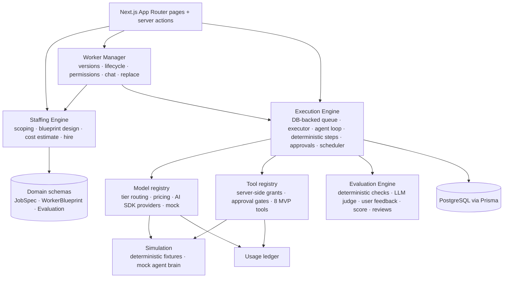

# AI Staffing Agency

**The staffing agency for AI workers.** Describe a job in plain English; the platform scopes it, designs the right AI worker, deploys it, measures its performance, and lets you improve or replace it — exactly like managing a contractor.

Core loop: **Job → Worker → Runs → Deliverables → Evaluation → Replace.**

This repository is the Phase 1 MVP: a full-stack Next.js app that proves the loop end to end on localhost, with a deterministic **Simulated mode** so the whole product works with zero API keys.

---

## Quick start

Prerequisites: Node ≥ 20 (tested on 25), PostgreSQL 14+ running locally.

```bash
createdb ai_staffing_agency
cp .env.example .env            # fill DATABASE_URL, AUTH_SECRET, CREDENTIAL_ENCRYPTION_KEY
npm install                     # also runs prisma generate
npm run setup                   # prisma migrate deploy + demo seed
npm run dev                     # http://localhost:3000
```

Sign in with the pre-filled demo account (`demo@aistaffing.dev` / `demo1234`). The workspace comes seeded with three workers, three weeks of run history, deliverables, evaluations, a performance review, and one pending approval — it doubles as the YC demo environment.

### Going live (optional)

Add any of `ANTHROPIC_API_KEY`, `OPENAI_API_KEY`, `GOOGLE_GENERATIVE_AI_API_KEY` to `.env` and restart. Tiers route to the first available provider (Anthropic → OpenAI → Google); override per tier with `MODEL_TIER_FAST|STANDARD|REASONING="<provider>:<model>"`. Add `TAVILY_API_KEY` (env or the Settings → Tool credentials vault) for real web search — it only takes effect once a model provider key is set too, because a run started in Simulated mode keeps every tool simulated. Without model keys the app runs in **Simulated mode** — clearly badged in the UI — on a deterministic mock provider and simulated tools.

### Commands

| Command | What it does |
|---|---|
| `npm run dev` | Next.js dev server + in-process executor/scheduler |
| `npm run typecheck` | `tsc --noEmit` |
| `npm test` | Vitest suite (needs the `ai_staffing_agency_test` DB and a `.env.test` — see [Tests](#tests)) |
| `npm run db:seed` | Re-seed the demo workspace (idempotent) |
| `npm run db:deploy` | Apply migrations |

---

## What you can do

1. **Hire** (`/hire`): describe a job → answer ≤ 3 follow-up questions → approve a structured **Job Spec** → meet the proposed worker (responsibilities, pipeline, tools, KPIs, cost estimate) → **Hire**. The first run starts immediately.
2. **Watch it work** (`/runs/[id]`): a live, humanized timeline of every step — model turns, tool calls, deterministic steps, deliverable, evaluation — with a full debug trace.
3. **Approve risky actions** (`/approvals`): approval-gated tools (e.g. sending a report) pause the run at *Needs approval*; approve or reject and the worker resumes.
4. **Review deliverables** (`/deliverables/[id]`): accept or reject with feedback — this feeds the worker's score.
5. **Manage the worker** (`/workers/[id]`): overview, activity, deliverables, performance (score, KPIs, trend, reviews), cost, permissions (server-enforced tool grants + approval toggles), *Talk to worker* (questions, one-off instructions, permanent changes → proposed version), versions, debug.
6. **Replace** (`/workers/[id]/replace/[versionId]`): the platform analyzes failed runs, low scores and rejected deliverables, proposes a revised blueprint with a diff and estimated quality/cost/latency deltas; *Hire replacement* retires the old version while the job and full run history survive.
7. **Usage & Settings**: cost by day/worker/model/tool with COGS vs billable; provider status; encrypted tool-credential vault.

---

## Architecture



Monolithic Next.js 15 app with strict module boundaries under `src/server/` (see `docs/CONTRACTS.md` for the full contract and file ownership). Dependency direction, no cycles:

`domain ← models / simulation / secrets / activity / usage ← tools ← evaluation ← runtime ← staffing ← workers ← queries / app`

### Key design decisions

- **Blueprints are pipelines, not prompts.** A `WorkerBlueprint` is an ordered list of components sharing a run context: *agent* components (LLM tool-calling loops) and *deterministic* components (validate, dedupe, rank, stats, CSV, report). The Staffing Engine pushes as much work as possible into deterministic steps — which is how workers get cheaper over time.
- **Immutable versions.** `Job → many WorkerVersions → many Runs`. A version is locked once a run references it; every change (chat-driven spec change or replacement) creates a new version, so performance can be compared across versions.
- **Durable, DB-backed execution.** All executor state lives in Postgres (`Run.checkpoint`). The in-process loop claims runs atomically, heartbeats, fences every write on its lease, recovers stale runs, and resumes idempotently after an approval or a crash (an approved external-write action never executes twice).
- **Permissions are server-side.** A tool call executes only if the tool is in the version's blueprint, a non-revoked grant exists, and — for approval-gated grants — an `Approval` for that exact call was approved. There is no code path around `tools.invoke()`.
- **Every model and tool call is metered** (`ModelCall`, `ToolCall`, `UsageRecord`) with COGS and billable amounts; the same ledger will drive Stripe metering in Phase 2.
- **Simulated mode is a first-class product surface.** The mock provider is deterministic and content-aware: output quality depends on the blueprint (tier, instructions, cleaning steps), so evaluation, health and the Replace flow behave realistically without a single API call.

### Data model (Prisma)

`Organization · User · Job · JobSpec · Worker · WorkerVersion · WorkerToolGrant · Run · RunStep · ModelCall · ToolCall · Deliverable · Evaluation · WorkerReview · Approval · WorkerMessage · ActivityEvent · UsageRecord · Credential`

### Code map

```
prisma/               schema, migrations, seed
src/app/(app)/        workforce · hire · jobs · workers/[id] (9 tabs) · runs/[id] · deliverables · approvals · activity · usage · settings
src/app/(auth)/       sign-in
src/components/       UI kit (see src/components/README.md)
src/server/domain/    Zod schemas: JobSpec, WorkerBlueprint, BlueprintDraft, evaluation, replacement, schedule
src/server/models/    llm — tier routing, pricing, AI SDK providers, mock provider
src/server/simulation/ fixtures + deterministic mock agent brain
src/server/tools/     registry, permission enforcement, tools (web_search, fetch_url, extract_data, read_dataset, csv_export, create_report, calculator, send_notification)
src/server/runtime/   queue, executor, agent loop, deterministic steps, approvals, scheduler
src/server/evaluation/ deterministic checks, LLM judge, feedback, score, health, reviews
src/server/staffing/  scoping, family templates, blueprint design, cost estimate, hire
src/server/workers/   versions, lifecycle, permissions, chat, replace
src/server/queries/   read-side view models per page
tests/                Vitest suites per module + tests/e2e/full-loop.test.ts
```

---

## Tests

One-time setup — a separate database plus a `.env.test` next to `.env` (it is gitignored like every `.env*` file, and Vitest reads its settings from it and nowhere else):

```bash
createdb ai_staffing_agency_test
cat > .env.test <<EOF
DATABASE_URL="postgresql://$(whoami)@localhost:5432/ai_staffing_agency_test?schema=public&options=-c%20TimeZone%3DUTC"
AUTH_SECRET="$(openssl rand -base64 32)"
AUTH_TRUST_HOST=true
CREDENTIAL_ENCRYPTION_KEY="$(openssl rand -base64 32)"
EXECUTOR_DISABLED=true
EOF
```

Adjust the `DATABASE_URL` user/password if your Postgres is not a default Homebrew install. The database name must end in `_test` (the suite refuses to run otherwise), and the URL keeps the `TimeZone=UTC` option like `.env`. Migrations are applied automatically at the start of each run, and provider keys are cleared, so tests always run in Simulated mode.

`npm test` then runs the Vitest suite against `ai_staffing_agency_test` in Simulated mode: schema validation, versioning immutability, run state transitions, atomic claiming and stale-lock recovery, server-side permission enforcement, approval pause/resume idempotency, evaluators and scoring, cost math, replacement workflow, and a full mock-mode end-to-end engine test (job → spec → blueprint → hire → run → deliverable → evaluation → feedback → review → chat → replace).

---

## Limitations (Phase 1)

- Live provider paths are implemented against the installed AI SDK v5 types but have not been exercised with real keys in this environment; simulated paths are fully tested.
- `read_dataset` and `send_notification` are simulated by design (sample datasets, outbox delivery); real connectors, Slack/Gmail/Sheets/HubSpot and Stripe metering are Phase 2.
- The executor runs in-process (`instrumentation.ts`); it survives restarts because state is in Postgres, but horizontal scaling needs the Phase 2 queue swap (Inngest/Trigger.dev).
- Credentials auth with a seeded user; Clerk/OAuth is Phase 2. Model-provider keys are env-only; the vault feeds tools only.
- `npm audit` reports transitive advisories inside the pinned major lines (Next 15, Prisma 6, AI SDK 5); upgrade paths are tracked for Phase 2.
- Light theme only; no mobile-first layouts beyond a collapsible sidebar.

## Roadmap

Phase 2 (design-partner beta): hosted deploy, real integrations behind the existing tool/credential abstractions, Stripe metered billing on `UsageRecord`, golden-set evaluations. Phase 3: proven-worker marketplace and autonomous improvement proposals. Phase 4: AI workforce layer (departments, SSO/RBAC, private connectors).
