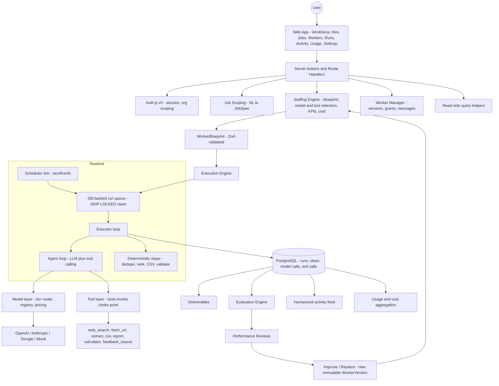
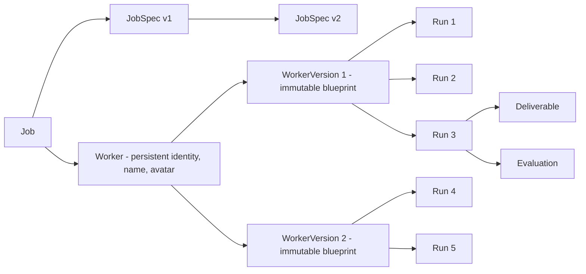
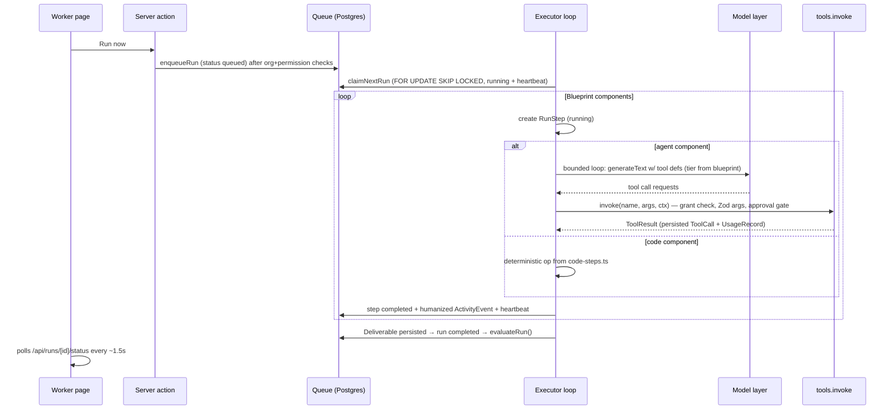

# Architecture

Monolithic Next.js 15 application with strict internal module boundaries. Server-side modules live under `src/server/` and are never value-imported by client components (exceptions listed in [CONTRACTS.md](./CONTRACTS.md)). The design goal: every MVP abstraction maps 1:1 to a Phase 2 production swap (queue → Inngest, auth → OAuth/Clerk, usage records → Stripe metering) without rework.

## 1. System overview



## 2. Core entity relationship

The Job survives worker replacement; every Run pins the exact WorkerVersion that produced it.



## 3. Repository file tree (complete)

```text
.
├── docs/                          # This planning suite
├── prisma/
│   ├── schema.prisma              # FROZEN after Phase 1 database task (see CONTRACTS)
│   ├── migrations/
│   └── seed.ts                    # Demo org, users, workers, runs, deliverables
├── public/                        # Static assets (favicon, og image)
├── src/
│   ├── middleware.ts              # Auth gate for (app) routes + security headers
│   ├── app/
│   │   ├── layout.tsx             # Root layout, fonts, toaster
│   │   ├── globals.css            # Tailwind v4 theme tokens
│   │   ├── (auth)/sign-in/
│   │   │   ├── page.tsx           # Credentials sign-in, demo hint card
│   │   │   └── actions.ts
│   │   ├── (app)/                 # Authenticated shell: sidebar nav + topbar
│   │   │   ├── layout.tsx
│   │   │   ├── page.tsx           # Workforce dashboard (/)
│   │   │   ├── hire/              # Multi-step hire flow
│   │   │   │   ├── page.tsx       # Intake → questions → spec review → proposal
│   │   │   │   ├── actions.ts     # scopeJob, generateProposal, hireWorker
│   │   │   │   ├── schema.ts
│   │   │   │   └── components/    # IntakeForm, SpecReview, ProposalCard, ...
│   │   │   ├── jobs/
│   │   │   │   ├── page.tsx
│   │   │   │   └── [jobId]/page.tsx
│   │   │   ├── workers/[workerId]/
│   │   │   │   ├── page.tsx       # Profile: tabs via ?tab= (overview, activity,
│   │   │   │   │                  #   deliverables, performance, permissions, versions, debug)
│   │   │   │   ├── actions.ts     # runNow, pause, resume, message, review, replace, feedback
│   │   │   │   ├── schema.ts
│   │   │   │   └── components/    # ProfileHeader, ActivityFeed, ChatPanel, ReviewCard,
│   │   │   │                      # ReplaceDialog, PermissionsTable, VersionTimeline, ...
│   │   │   ├── runs/[runId]/
│   │   │   │   ├── page.tsx       # Run detail: timeline, deliverable, evaluation, debug tab
│   │   │   │   └── actions.ts     # approve/reject approval, cancel run, accept deliverable
│   │   │   ├── activity/page.tsx  # Org-wide humanized feed
│   │   │   ├── usage/page.tsx     # Cost dashboards (recharts)
│   │   │   └── settings/
│   │   │       ├── page.tsx       # Org, model providers status, simulated-mode badge
│   │   │       └── actions.ts
│   │   └── api/
│   │       ├── auth/[...nextauth]/route.ts
│   │       ├── health/route.ts    # Liveness + DB check
│   │       ├── runs/[runId]/status/route.ts     # Polled by run/worker pages
│   │       └── deliverables/[deliverableId]/download/route.ts  # CSV/MD/JSON download
│   ├── components/
│   │   ├── ui/                    # shadcn/ui primitives (button, card, dialog, ...)
│   │   ├── layout/                # Sidebar, Topbar, PageHeader, SimulatedBadge
│   │   └── shared/                # WorkerAvatar, StatusBadge, ScoreRing, MetricCard,
│   │                              # RunStatusPill, CostStat, EmptyState, Skeletons
│   ├── lib/
│   │   ├── action-result.ts       # ActionResult<T> type + helpers
│   │   ├── format.ts              # Money, dates, durations, tokens, scores
│   │   ├── nav.ts                 # Nav model (Workforce, Jobs, Activity, Usage, Settings)
│   │   └── utils.ts               # cn(), misc
│   └── server/
│       ├── config.ts              # FROZEN. Zod-parsed env, provider detection, isSimulated
│       ├── db.ts                  # FROZEN. Prisma singleton, toJson()
│       ├── errors.ts              # FROZEN. AppError, notFound(), forbidden(), toActionError()
│       ├── auth/
│       │   ├── config.ts          # Auth.js credentials provider, JWT callbacks
│       │   ├── session.ts         # requireSession(): { userId, organizationId, role }
│       │   └── rate-limit.ts      # In-memory token buckets (login, scoping, run-now, chat)
│       ├── domain/                # FROZEN. Pure Zod schemas + types, no I/O
│       │   ├── job-spec.ts        # JobSpecSchema, parseJobSpec, FollowUpQuestion
│       │   ├── blueprint.ts       # WorkerBlueprintSchema, parseBlueprint, components
│       │   ├── run.ts             # RunStatus transitions map, StepDef, RunContext
│       │   ├── evaluation.ts      # Metric defs, rubric, score weights
│       │   ├── replacement.ts     # ReplacementProposalSchema, diff types
│       │   └── index.ts
│       ├── models/                # ONLY module importing ai / @ai-sdk/*
│       │   ├── index.ts           # llm.generateText / llm.generateObject (tier, tracking, mock)
│       │   ├── registry.ts        # tier → provider model resolution by available keys
│       │   ├── pricing.ts         # USD per 1M tokens per model + estimate helpers
│       │   ├── tracking.ts        # CallTracking: persist ModelCall + UsageRecord
│       │   ├── mock.ts            # Deterministic simulated provider (hash-seeded)
│       │   └── types.ts           # FROZEN. Tier, ModelRequest/Response, CallTracking
│       ├── tools/
│       │   ├── index.ts           # registry + tools.invoke() (grants, validation, approvals)
│       │   ├── schemas.ts         # FROZEN. Zod arg/result schemas for every tool
│       │   ├── types.ts           # FROZEN. ToolDefinition, ToolContext, ToolResult
│       │   ├── permissions.ts     # grant checks against WorkerToolGrant
│       │   ├── http-guard.ts      # SSRF defenses for outbound fetches
│       │   └── impl/
│       │       ├── web-search.ts  # Tavily if key present, else deterministic simulated corpus
│       │       ├── fetch-url.ts   # Real HTTP fetch + readability extraction (guarded)
│       │       ├── extract-structured.ts  # LLM-backed extraction (fast tier)
│       │       ├── generate-csv.ts        # Deterministic, formula-injection safe
│       │       ├── save-report.ts         # Persists markdown deliverable
│       │       ├── calculator.ts          # Safe expression parser (no eval)
│       │       └── feedback-source.ts     # Seeded feedback dataset reader (demo 2)
│       ├── runtime/
│       │   ├── types.ts           # FROZEN. RunHandle, StepResult, ExecutorOptions
│       │   ├── queue.ts           # enqueueRun, claimNextRun (SKIP LOCKED), heartbeat
│       │   ├── executor.ts        # executeRun(runId): walk blueprint components
│       │   ├── agent-loop.ts      # Bounded LLM+tool loop per agent component
│       │   ├── code-steps.ts      # Deterministic op library (dedupe, rank, validate, csv)
│       │   ├── state.ts           # Run/step state machine, allowed transitions
│       │   ├── approvals.ts       # pause/resume around approval-gated tool calls
│       │   ├── scheduler.ts       # tickScheduler(): due nextRunAt → enqueue
│       │   ├── recover.ts         # recoverStaleRuns(): stale heartbeats → retry/fail
│       │   └── bootstrap.ts       # Dev-mode executor + scheduler interval wiring
│       ├── staffing/
│       │   ├── scope.ts           # scopeJob(): NL (+answers) → JobSpec draft
│       │   ├── questions.ts       # Minimal follow-up question generation
│       │   ├── design.ts          # designWorker(): JobSpec → WorkerBlueprint
│       │   ├── selection.ts       # Deterministic model-tier + tool selection rules
│       │   ├── cost.ts            # estimateCost(blueprint) from pricing table
│       │   ├── replace.ts         # analyzeWorker() + proposeReplacement() + hireReplacement()
│       │   ├── spec-change.ts     # Chat-driven spec change → proposed version N+1
│       │   └── names.ts           # Deterministic worker name/avatar assignment
│       ├── evals/
│       │   ├── index.ts           # evaluateRun(runId): run all applicable evaluators
│       │   ├── deterministic.ts   # Volume, schema completeness, tool-failure rate
│       │   ├── judge.ts           # LLM judge against JobSpec rubric
│       │   ├── feedback.ts        # Deliverable accept/reject → evaluation record
│       │   ├── score.ts           # computeWorkerScore(): weighted aggregate
│       │   └── review.ts          # generateReview(): strengths/concerns/recommendation
│       ├── workers/
│       │   ├── manage.ts          # hireWorker, pause, resume, terminate, version locking
│       │   └── messages.ts        # classifyMessage → temporary | spec_change | question
│       ├── activity/
│       │   ├── log.ts             # logActivity(orgId, type, message, refs)
│       │   └── humanize.ts        # Step/tool events → "Alex searched the web for ..."
│       ├── usage/
│       │   ├── record.ts          # recordModelUsage / recordToolUsage (dual-write)
│       │   └── aggregate.ts       # Totals by day/worker/job, cost-per-deliverable
│       └── queries/               # Read-side helpers; orgId first arg; plain objects out
│           ├── workforce.ts       # Dashboard cards/table
│           ├── workers.ts         # Profile: overview, versions, permissions, chat
│           ├── jobs.ts            # Job list/detail with spec history
│           ├── runs.ts            # Run detail, steps, calls, debug trace
│           ├── activity.ts        # Feeds (org-wide + per-worker)
│           ├── usage.ts           # Charts and stat cards
│           └── approvals.ts       # Pending approvals for badges/inbox
├── tests/
│   ├── setup/global.ts            # Test DB bootstrap (ai_staffing_agency_test)
│   ├── helpers/factory.ts         # createTestOrg() → { organization, user, session, cleanup }
│   ├── helpers/fixtures.ts        # makeJobSpec, makeBlueprint, createHiredWorker
│   ├── domain/                    # Schema validation tests
│   ├── staffing/                  # Scoping, design, cost, replacement
│   ├── runtime/                   # Queue, state machine, executor, approvals
│   ├── tools/                     # Registry, permissions, SSRF guard, csv safety
│   ├── evals/                     # Evaluators, scoring, review
│   └── e2e/happy-path.test.ts     # Full loop in simulated mode
├── .env.example
├── .gitignore
├── README.md
├── components.json                # shadcn/ui config
├── next.config.ts
├── package.json
├── postcss.config.mjs
├── tsconfig.json
└── vitest.config.mts
```

## 4. The Staffing Engine pipeline

```text
Natural-language request
        ↓  llm.generateObject (reasoning tier) + minimal follow-up questions
Job Specification (Zod: objective, tasks, schedule, success metrics,
                   output format, constraints, required capabilities)
        ↓  deterministic capability → tool mapping (selection.ts)
        ↓  llm.generateObject (reasoning tier) for architecture + prompts
Worker Blueprint (Zod: role, responsibilities, architecture {pipeline of
                  agent|code components}, per-component model tier, tool
                  grants + approval flags, KPIs, memory policy)
        ↓  deterministic cost estimate (pricing.ts: est. tokens × tier price + tool costs)
Hiring proposal (contractor card: name, responsibilities, tools, schedule,
                 expected output, estimated cost/run and /month)
        ↓  user clicks Hire
Worker + WorkerVersion 1 (immutable once first run starts) + tool grants persisted
```

Design rules enforced by `selection.ts`, not left to the LLM:
- Tools come only from the registry allowlist; the LLM proposes capabilities, code maps them to tools.
- Deterministic steps (dedupe, rank, CSV, schema validation) are code components, never LLM calls.
- Model tiers: `fast` (extraction, classification), `standard` (research synthesis, drafting), `reasoning` (scoping, blueprint design, replacement analysis, judge).

## 5. Run execution flow



- **Approval gate:** if a granted tool has `requiresApproval`, the executor persists an `Approval` (pending), sets run `waiting_approval`, and exits. Approving re-enqueues; the executor resumes from persisted step state (completed steps are skipped by key).
- **Retries:** per-step `attempts` with capped exponential backoff for recoverable errors (tool timeouts, transient model errors). Terminal errors fail the run with a structured error. Partial output → `completed_with_warnings` when the deliverable exists but KPIs missed.
- **Budgets:** every run carries hard caps — max steps, max model calls, max tokens, max tool calls, max wall-clock — from blueprint defaults; exceeding a cap is a terminal, well-labeled failure.
- **Recovery:** `recoverStaleRuns()` re-queues runs whose heartbeat is stale (crash mid-run) up to a retry cap, then marks failed.
- **Scheduler:** `tickScheduler()` scans workers with due `nextRunAt`, enqueues scheduled runs, computes the next occurrence (weekday/daily/weekly parsing lives in domain).

## 6. Model layer

- `llm.generateText / llm.generateObject` are the only entry points; both require a `tier`, a `CallTracking` context, and support deterministic `mock` responses. Direct `ai` / `@ai-sdk/*` imports are banned outside `src/server/models/`.
- `registry.ts` resolves tier → concrete model from available env keys at call time: e.g. with OpenAI keys `fast → gpt-4.1-mini`-class, `standard → gpt-4.1`-class, `reasoning → o-series`-class; equivalents for Anthropic/Google; else the mock provider. Model names live only here and in `pricing.ts`.
- Every call records a `ModelCall` (provider, model, tier, purpose, tokens, latency, cost, simulated flag) and a `UsageRecord` — the substrate for cost dashboards now and Stripe metering later.
- The mock provider returns schema-valid, realistic objects per purpose (scoping, design, synthesis, judge, classify), seeded by a stable hash of the request so identical inputs are reproducible and tests can assert.

## 7. Memory model

- **Job memory:** durable facts/instructions on the Job (`JobMemory` rows; e.g. "exclude companies < 50 employees" as a permanent instruction, or temporary ones flagged with expiry). Injected into agent context selectively by the executor.
- **Worker configuration:** the immutable blueprint (prompts, components, tiers, tools) on the WorkerVersion.
- **Run context:** ephemeral state passed between steps within a run (prior step outputs by key); persisted on RunSteps for resume/debug, never carried across runs wholesale.
- **Execution history:** aggregates only (recent evaluation scores, failure patterns) summarized into replacement analysis and reviews — full history is never dumped into prompts.

## 8. Simulated mode

- `config.isSimulated` is true when no provider keys exist; Settings and the app shell show a "Simulated" badge; model/tool calls are flagged `simulated` in the debug trace.
- Simulated web search serves a curated, realistic corpus (AI-infrastructure startups with funding data; customer feedback set for demo 2) — deterministic per query hash.
- Costs in simulated mode use real pricing tables against simulated token counts, so dashboards and unit economics behave identically.
- The architecture is identical in both modes; only the provider/tool backends swap. Nothing in product code branches on "demo".

## 9. Non-goals for Phase 1

No external queue/Redis, no Stripe charging (usage records only), no OAuth/social login, no real Slack/Gmail/HubSpot integrations (credential vault + tool abstraction exist), no multi-user org management UI, no mobile-specific layouts (responsive desktop-first only).
