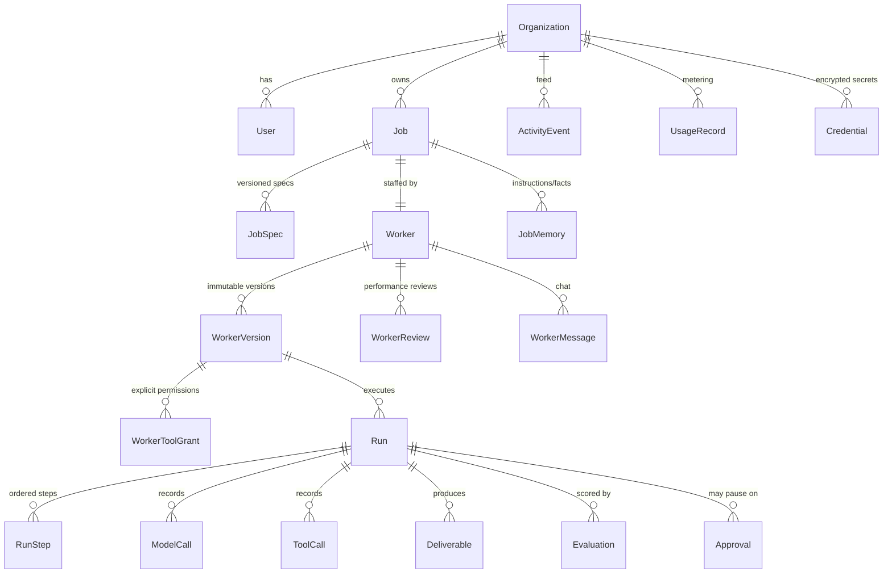

# Data Model

PostgreSQL 14 via Prisma 6. All ids are `cuid()` (non-sequential — no enumeration). All models carry `createdAt` (+ `updatedAt` where mutation is expected). Money is `Decimal(12,6)` USD. Every tenant-owned table carries `organizationId` with an index; uniqueness constraints are always scoped to the tenant or a parent.

## 1. Entity relationship overview



## 2. Enums

```prisma
enum OrgRole            { owner admin member }
enum JobStatus          { draft active paused closed }
enum SpecStatus         { draft approved superseded }
enum WorkerStatus       { active idle paused needs_attention terminated }
enum WorkerVersionStatus{ proposed active retired rejected }
enum RunStatus          { queued running waiting_approval completed completed_with_warnings failed cancelled }
enum RunTrigger         { manual scheduled chat replacement_test }
enum StepType           { agent tool code validation }
enum StepStatus         { pending running completed failed skipped waiting_approval }
enum DeliverableType    { report dataset summary }
enum DeliverableFormat  { markdown csv json }
enum FeedbackVerdict    { pending accepted rejected }
enum EvaluationKind     { deterministic llm_judge user_feedback aggregate }
enum ApprovalStatus     { pending approved rejected expired }
enum MessageRole        { user worker }
enum MessageEffect      { none answered temporary_instruction spec_change_proposed }
enum MemoryKind         { instruction fact }
enum UsageKind          { model_tokens tool_call }
enum ActivityType       { job_created spec_approved worker_hired worker_paused worker_resumed
                          worker_terminated worker_replaced version_created run_queued run_started
                          run_step run_completed run_failed run_cancelled approval_requested
                          approval_resolved deliverable_created deliverable_feedback
                          review_generated message_received instruction_added }
```

`RunStatus` legal transitions (enforced in `domain/run.ts`, tested):
`queued → running | cancelled` · `running → waiting_approval | completed | completed_with_warnings | failed | cancelled` · `waiting_approval → queued (resume) | cancelled | failed (rejected/expired)` · terminal: `completed, completed_with_warnings, failed, cancelled`.

## 3. Models

### Identity & tenancy

- **Organization** — `id, name, slug (unique), settingsJson (budget caps: dailyUsdCap, maxConcurrentRuns), createdAt, updatedAt`
- **User** — `id, organizationId FK, email (unique), name, passwordHash (bcrypt cost 12), role OrgRole, createdAt, updatedAt`. Index: `organizationId`.

### Job side

- **Job** — `id, organizationId FK, title, request (original natural-language ask), status JobStatus, scheduleJson (parsed schedule), createdAt, updatedAt`. Index: `(organizationId, status)`.
- **JobSpec** — `id, jobId FK, version Int, specJson (validated JobSpec), summary (human-readable), status SpecStatus, createdAt, approvedAt?`. Unique: `(jobId, version)`. New spec versions supersede; never mutate approved specs.
- **JobMemory** — `id, jobId FK, kind MemoryKind, content, source (user_chat|system), active Boolean, expiresAt?, createdAt`. Temporary instructions = `active` with `expiresAt` or cleared after next run; permanent facts persist. Index: `(jobId, active)`.

### Worker side

- **Worker** — `id, organizationId FK, jobId FK (unique — one active staffing per job), name, title, avatarColor, status WorkerStatus, hiredAt, terminatedAt?, nextRunAt?, lastRunAt?, createdAt, updatedAt`. Index: `(organizationId, status)`, `nextRunAt` (scheduler scan).
- **WorkerVersion** — `id, workerId FK, version Int, blueprintJson (validated WorkerBlueprint), changeSummary (why this version exists), status WorkerVersionStatus, createdAt, activatedAt?, retiredAt?, lockedAt?`. Unique: `(workerId, version)`. **Invariant: once `lockedAt` is set (first run enqueued), `blueprintJson` is immutable — enforced in `workers/manage.ts`, never bypassed.**
- **WorkerToolGrant** — `id, workerVersionId FK, toolName, allowed Boolean, requiresApproval Boolean, configJson?`. Unique: `(workerVersionId, toolName)`. Denormalized from blueprint at hire time so permission checks are one indexed lookup and the permissions UI edits are auditable.

### Execution

- **Run** — `id, organizationId FK, jobId FK, workerId FK, workerVersionId FK, status RunStatus, trigger RunTrigger, scheduledFor?, startedAt?, finishedAt?, heartbeatAt?, attempt Int (recovery retries), summary? (humanized outcome), errorJson? ({ code, message, stepKey, retryable }), costUsd Decimal, createdAt`. Indexes: `(status, scheduledFor)` queue claim; `(organizationId, createdAt)`; `(workerId, createdAt)`; `(workerVersionId)`.
- **RunStep** — `id, runId FK, index Int, key (blueprint component key), title, type StepType, status StepStatus, attempts Int, startedAt?, finishedAt?, inputJson?, outputJson?, errorJson?, humanSummary? ("Searched the web for recently funded…")`. Unique: `(runId, index)`. Resume logic skips steps with `status = completed` by `key`.
- **ModelCall** — `id, organizationId FK, runId? FK, stepId? FK, provider, model, tier, purpose, inputTokens Int, outputTokens Int, costUsd Decimal, latencyMs Int, simulated Boolean, createdAt`. Index: `(organizationId, createdAt)`, `(runId)`.
- **ToolCall** — `id, organizationId FK, runId FK, stepId? FK, toolName, argsJson, resultJson?, ok Boolean, error?, retryable Boolean?, latencyMs Int, costUsd Decimal, simulated Boolean, createdAt`. Index: `(runId)`, `(organizationId, toolName, createdAt)` (tool failure analytics).

### Output & quality

- **Deliverable** — `id, organizationId FK, runId FK, jobId FK, workerVersionId FK, type DeliverableType, format DeliverableFormat, title, description?, contentText? (markdown/csv), contentJson? (structured records), feedback FeedbackVerdict, feedbackNote?, feedbackAt?, createdAt`. Index: `(organizationId, createdAt)`, `(jobId, createdAt)`.
- **Evaluation** — `id, organizationId FK, runId FK, workerVersionId FK, kind EvaluationKind, overallScore Float (0–100), metricsJson (MetricResult[]), notes?, simulated Boolean, createdAt`. Index: `(workerVersionId, createdAt)`, `(runId)`.
- **WorkerReview** — `id, organizationId FK, workerId FK, workerVersionId FK, overallScore Float, strengthsJson (string[]), concernsJson (string[]), recommendation Text, recommendedAction (keep|improve|replace), periodFrom, periodTo, createdAt`. Index: `(workerId, createdAt)`.

### Control & audit

- **Approval** — `id, organizationId FK, runId FK, stepId? FK, toolName, actionSummary ("Send report to 428 contacts"), payloadJson (proposed args), status ApprovalStatus, requestedAt, resolvedAt?, resolvedById? FK User, resolutionNote?`. Index: `(organizationId, status)`.
- **WorkerMessage** — `id, organizationId FK, workerId FK, role MessageRole, content Text, effect MessageEffect, proposedVersionId? FK WorkerVersion, createdAt`. Index: `(workerId, createdAt)`.
- **ActivityEvent** — `id, organizationId FK, type ActivityType, message (humanized), jobId?, workerId?, runId?, actorUserId?, createdAt`. Index: `(organizationId, createdAt DESC)`, `(workerId, createdAt DESC)`. Append-only.
- **UsageRecord** — `id, organizationId FK, kind UsageKind, quantity Decimal (tokens or calls), unit ("tokens"|"call"), costUsd Decimal, runId?, workerId?, jobId?, occurredAt`. Index: `(organizationId, occurredAt)`, `(workerId, occurredAt)`. Written alongside ModelCall/ToolCall; this is the billing substrate (Stripe metering in Phase 2 reads only this table).
- **Credential** — `id, organizationId FK, provider, label, ciphertext (AES-256-GCM), iv, authTag, createdAt, lastUsedAt?`. Unique: `(organizationId, provider, label)`. Secrets never leave the server; UI shows label + masked suffix only. (Vault abstraction for future integrations; MVP provider keys come from env.)

## 4. Cross-cutting invariants

1. **Tenancy:** every query on tenant tables includes `organizationId`; child lookups verify the parent chain (e.g. run → job → organizationId) in one `where`.
2. **Version immutability:** `WorkerVersion.lockedAt` set at first enqueue; subsequent blueprint edits impossible — changes create version N+1 with `changeSummary`.
3. **History preservation:** replacing/terminating a worker retires versions (`retired`) and updates `Worker.status`; **no cascade deletes** on Job/Worker/Run/Deliverable — history is the product. Cascades exist only within a run's children (steps/calls) and org deletion (Phase 2+ admin path).
4. **Run pinning:** `Run.workerVersionId` is required; UI and evals always attribute results to the exact version.
5. **Queue correctness:** claim = `UPDATE ... SET status='running', heartbeatAt=now() WHERE id = (SELECT id FROM "Run" WHERE status='queued' AND (scheduledFor IS NULL OR scheduledFor <= now()) ORDER BY "createdAt" LIMIT 1 FOR UPDATE SKIP LOCKED) RETURNING id` — safe under concurrent executors.
6. **Money:** `Decimal` end-to-end in DB; `Number()` conversion only inside `src/server/queries/*`; formatting only via `src/lib/format.ts`.

## 5. Migration & seed strategy

- Single initial migration for Phase 1 (`prisma migrate dev --name init` run once by the human/build owner); schema FROZEN afterward; later phases use additive migrations (new tables/columns, no destructive changes without a data plan).
- `prisma/seed.ts` builds: demo org + user (`demo@aistaff.dev` / documented password), 3 jobs/workers (Alex — Market Researcher, active; Maya — Feedback Analyst, active; Sam — Market Analyst, needs_attention with failing runs), ~15 historical runs with steps/calls/costs, deliverables (reports + CSV), evaluations, one pending approval, one performance review recommending replacement for Sam, 30 days of usage records shaped to make dashboards look alive.
- Test DB `ai_staffing_agency_test` uses the same migrations; factories create isolated orgs per test; no global truncation.
